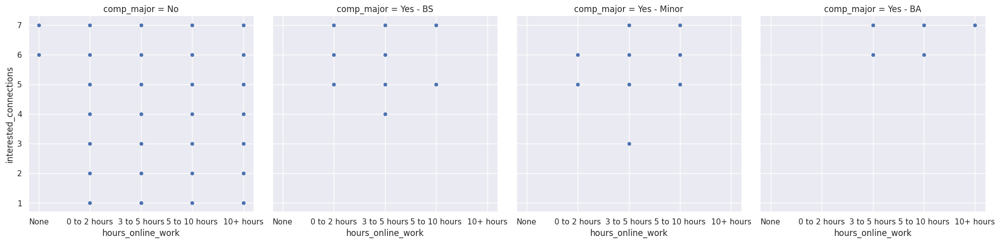
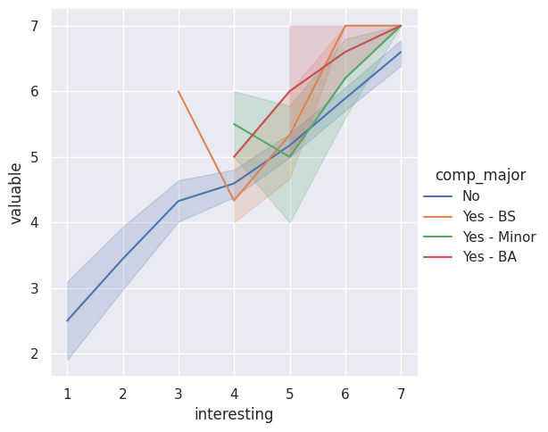
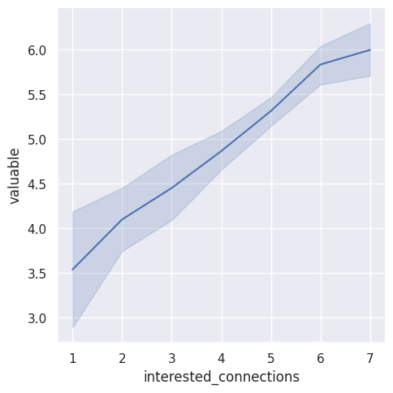
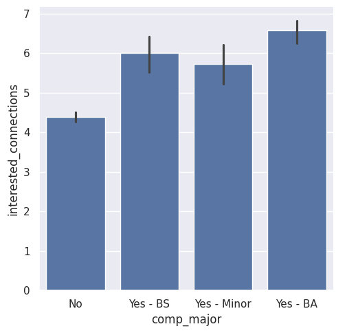
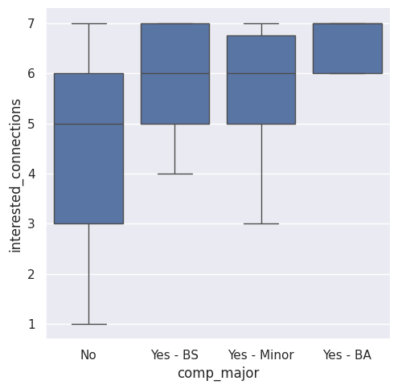
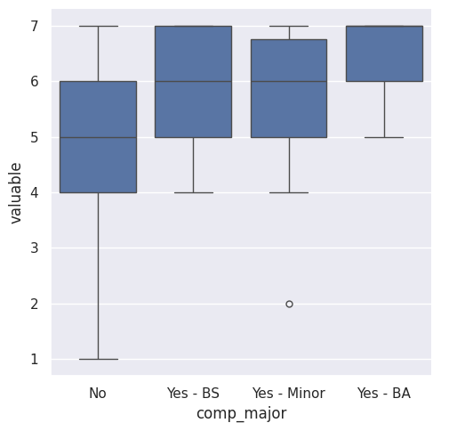

---
# Do not edit the text between these lines!
layout: default
---
## ^^^Not sure what this is 
# COMP 110 exercise 09 Website

<!-- This is a comment. Below, you'll see code for inserting an image. To make this image appear, update <custom-path>. To add an image, save it inside the imgs folder of this repository. -->

# Analysis

### Part 1.1: Creative Ideation

1. The course should inlcude more video walk-throughs and step-by-step proccesses to build confidence in students in concept learning and to help beginners who need better explanation
2. This course should include more small group coding during class to improve collaboration and improve understanding for those who learn through such means
3. This course should include more real-life examples from media because most students spend significant time online. This benefits students wh leanr through approachable examples
4. This course should include support systems specific to students in natural sciences in order to connect computer science to respectivre fields and see value in content in this class. This ensures people are not taking it only for pre-req status anf are unmotivated to apply it to their field.
5. This course should include more example coding excercises asynchronously or during class because it encourages peactice in practucal code writing. This beneifts students to find the most helpful and beneficial concept and coding for their ability.

### Part 1.2: Identifying Missing Data

1. Idea without sufficient data to analyze:

One idea without sufficient data to analyze is about the group collaboration during in-class coding exercises and itsb connection to student content understanding and teamwork. This is because the current questionnaire does not directly measure how group work affects learning in this course, and whether students actually prefer group work. The current survey doesn't track solo versus group concept learning either.

2. Suggestion for how to collect data to support this idea in the future: 

One way to collect this data is by asking if students engage in group learning outside of class and inside of class, and ask students to self-report their likert scale level of understanding of commonly missed concepts on exams. This could shed light on different learning approaches that may be allowing for better exam performance due to greater concept understanding.

### Part 1.3: Choosing Your Analysis

1. Idea to analyze with available data:

We plan to analyze our idea on alternative major students and their perceived interest and value in the course/content. We will look at the association between the predictor variable "Are you planning to major or minor in Computer Science" and the outcome variables "I am interested in the connections between computer science and other fields,"
"I believe the skills I am learning in this course will be valuable to me in the future," and "Scientific research is influenced by individual and/or societal biases."

2. This idea is more valuable than the others brainstormed because:

Our idea is relevant to all the other majors who are taking this class, which is a substantial proportion of the class. By giving incentive and motive to people who otherwise are not interested in COMP 110, and by having a suport network to encourgae them to take COMP now and in the future, these students can pursue COMP with more enthusiasm or potentially major or minor in it. Prior studies have shown that students who see the extended value and real-world connections in their studies also perform better in the course and actually learn better. This question has a high impact factor in terms of the number of students it affects,as well as high potential to improve student learning.

## 1st Data Graph
The graph tries to depict the correlation between how much time a person spends coding and how interested they are in applying COMP connections. This will tell how interested a person is in applying COMP ideas based off how much work they do. 

## 2nd Data Graph
This graph shows if theres line correlation between if someone is a COMP major and their level of interest and how valuable the course is.

## 3rd Data Graph
This graph shows if theres line correlation between their level of interest and how valuable the course is. There is very positive correlation of level of itnerest and value in the course

## 4th Data Graph 
This graph shows if theres bar correlation between if their a COMP major and thier interest in connections for comp applications. level of interest and how valuable the course is. There is very positive correlation of interest in connections and if their a COMP major

## 5th Data Graph
This graph shows if theres bar and line correlation between if their a COMP major and thier interest in connections for comp applications. level of interest and how valuable the course is. There is very positive correlation of interest in connections and if their a COMP major

## 6th Data Graph
This graph shows if theres bar and line correlation between if their a COMP major and thier value. 

# Conclusion
This study examined the associations between computer science (CS) enrollment and the perceived value of the COMP 110 course, including broader interdisciplinary connections and overall intellectual interest. This research question was motivated by prior findings suggesting that cultivating a student's perception of a subject's utility—even for material that initially seems unappealing—can significantly improve engagement and academic performance. Given that most COMP 110 students are non-CS majors with limited coding experience, we hypothesized that this group would report lower perceived value, interest, and impact due to a lack of previous exposure to the field.

To address our research question, we first analyzed the correlation between a student’s genuine interest and their valuation of the course. Interest was measured by the prompt "I believe the topics I am learning in this course are intellectually interesting," while value was assessed via "I believe the skills I am learning in this course will be valuable to me in the future." This association was evaluated across four groups: non-majors, BS majors, BA majors, and minors.

The results indicated that higher interest levels predicted greater perceived value across all cohorts; however, non-majors consistently reported the lowest minimum scores for both variables (Figure 1). Furthermore, a strong interest in interdisciplinary applications (coded as "I am interested in the connections between computer science and other fields") was associated with higher value perception (Figure 2). Ultimately, when assessing individual group responses regarding interest, connection, and value, non-majors consistently scored lower across all three metrics, with only marginal differences observed between the major and minor groups.

